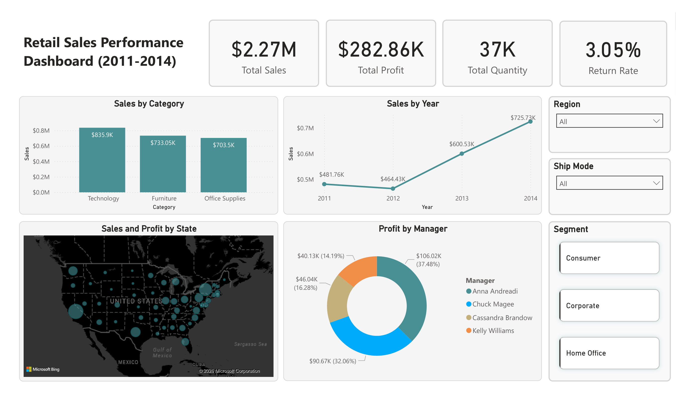
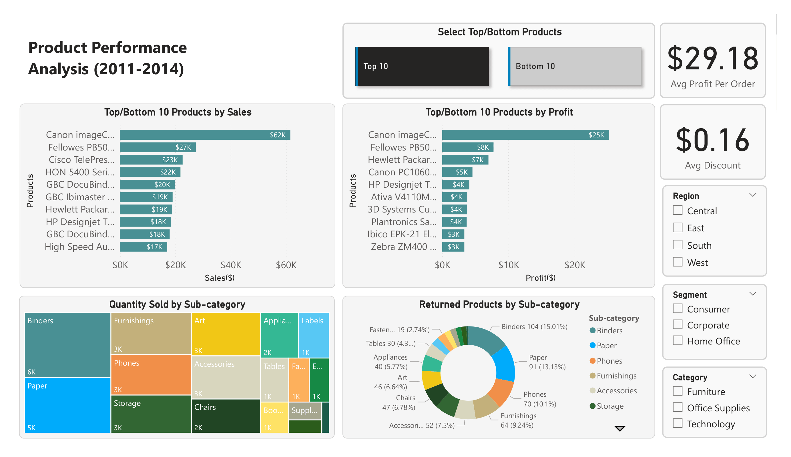
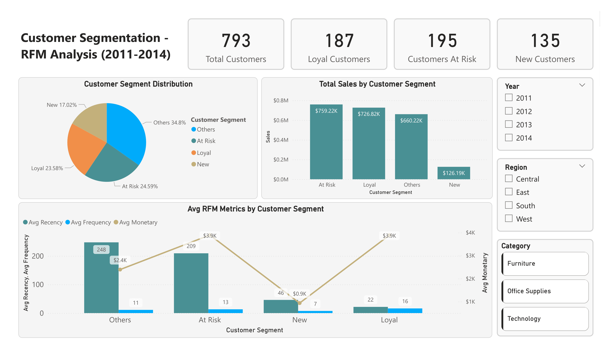
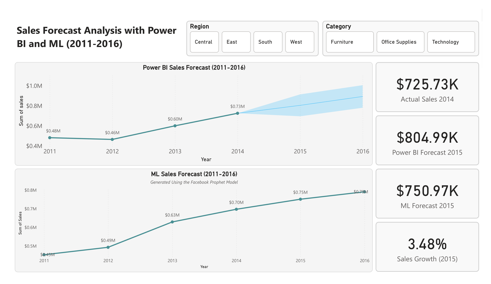

# 🛒 Retail Sales Analytics & Forecasting Project

This project focuses on analyzing and forecasting retail sales performance using historical data. It combines **data cleaning**, **exploratory data analysis**, **time series forecasting with Prophet**, and **Power BI dashboarding** to extract actionable insights.

---

## 📊 Project Goals

- Understand sales trends and profit performance by region, category, and segment
- Forecast future sales using machine learning (Prophet)
- Visualize key metrics using interactive Power BI dashboards
- Provide insights for decision-making and planning

---

## 🧰 Tools & Technologies Used

| Task                         | Tools Used                        |
|------------------------------|-----------------------------------|
| Data Handling                | Python, Pandas, Excel             |
| Forecasting                  | Facebook Prophet, Jupyter Notebook |
| Visualization & Reporting    | Power BI, Excel, Matplotlib       |
| Dataset                      | Superstore Sales Sample           |
| Version Control              | Git, GitHub                       |

---

## 📁 Project Structure

```text
retail-sales-analytics/
├── screenshots/
│   ├── dashboard_overview.png             # Main dashboard preview
│   ├── product_performance.png            # Product Performance
│   ├── customer segmentation.png          # Customer Segmentation(RFM Analysis)
│   └── forecast.png                       # Forecast Analysis
│
├── Sample-Superstore.csv                  # Raw retail dataset used for analysis
├── sales_forecast_prophet.ipynb           # Jupyter notebook for time series forecasting (Prophet)
├── ml_forecast.xlsx                       # Forecast output exported for Power BI integration
├── Retail_Sales_Analytics_Ananthu.pbix    # Interactive Power BI dashboard file
├── Retail_Sales_Analytics_Ananthu.pdf     # Static PDF version of dashboard (quick preview)
├── .gitignore                             # Files/folders excluded from Git tracking
└── README.md                              # Project documentation and overview
```

---

## 📥 Files Included

- `screenshots/` — Dashboard preview images for quick visual reference
- `Sample-Superstore.csv` — Raw retail dataset used for analysis
- `sales_forecast_prophet.ipynb` — Jupyter Notebook implementing time series forecasting with Prophet
- `ml_forecast.xlsx` — Forecasted results exported for Power BI integration
- `Retail_Sales_Analytics_Ananthu.pbix` — Interactive Power BI dashboard file
- `Retail_Sales_Analytics_Ananthu.pdf` — Static PDF version of the dashboard for quick viewing


---

## 🖼️ Dashboard Preview

### Main Dashboard


### Product Performnace


### Customer Segmentation(RFM)


### Forecast



## 📄 Dashboard Summary

📥 [Click here to view the Power BI Dashboard (PDF)](Retail_Sales_Analytics_Ananthu.pdf) 

*If the preview doesn't load, please download the PDF to view it fully.*

## 👨‍💻 Author

- **Ananthu Krishna G**

---

## 📜 License

This project was completed as part of a data analytics course. Free for educational and non-commercial use.
